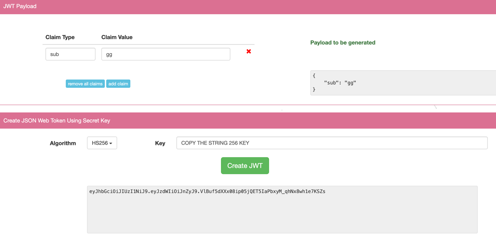
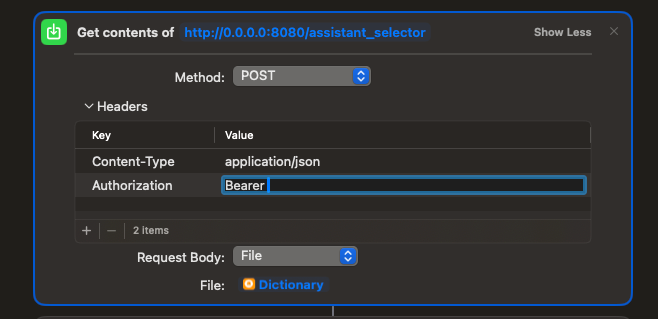
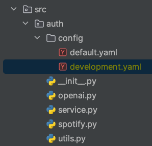
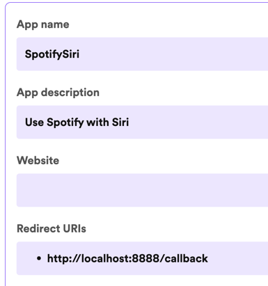

# SiriAssistant

You can find a more detailed explanation of the project in the following [link](https://medium.com/@biohazerimperion/b720febd7a46).

### how to run the service

1. Clone the repository
2. Create a virtual environment
3. Install poetry and the dependencies
```pycon
poetry install
poetry install --with dev
```
4. Generate the string secret key, this is your service secret key:
```
openssl rand -hex 256
```
**Store the key in a safe place, you will need it to generate the JWT token.**

5. Go to [this](https://www.javainuse.com/jwtgenerator) web page to generate the JWT token, use the following configuration:



The **algorithm** must be HS256, the secret key must be 'sub' and the values could be anything you want. This is the public token that you will use to authenticate the service in the "Jarvis Call Shortcut"



6. To run, you need to add the credentials to the "development.yaml" file in the "auth/config" folder.



The structure of the file is as follows:

```yaml
secrets:
  env: development
  api_tokens:
    service: 'The 256 key generated in step 4'
    token: 'The public token generated in step 5'
  openai:
    api_key: 'the openai api key'
    organization: 'org- your organization id'
  database:
    host: localhost
    port: 5432
    database: siri_assistant
    user: gg
    password: 1234
  pycharm_directories:
    - "USER_PATH/Projects1"
    - "USER_PATH/Projects2"
  spotify:
    client_id: 'client_id'
    client_secret: 'client_secret'
    redirect_uri: 'http://localhost:8888/callback'
    scope: 'user-modify-playback-state user-read-currently-playing user-read-playback-state'
```
The pycharm directories are the directories where the projects are stored (projects folders).

Optional: The spotify credentials are the credentials to access the spotify API. You can get them [here](https://developer.spotify.com/dashboard/applications), you have to create an app and get the client_id and client_secret.

After, in the setting of your dashboard, you have to add the redirect_uri as 'http://localhost:8888/callback'.



**Note:** If you want the service completely in docker, follow the next steps:

To use the service with Docker, you must uncomment the application description in the Docker configuration file. Furthermore, it's essential to replace the host value in the configuration with the specific name of the service, in this case, 'siri_assistant_database'. This change is critical because Docker uses the names of services defined in the docker-compose.yml file to facilitate communication between containers. By specifying 'siri_assistant_database' as the host, we are instructing our application to communicate with the database container using Docker's internal network
```pycon
database:
    host: siri_assistant_database
    port: 5432
    database: siri_assistant
    user: gg
    password: 1234
```
```dockerfile
version: '3'

services:
  app:
    container_name: siri_assistant_app
    build:
      context: .
      dockerfile: Dockerfile
    volumes:
      - .:/app
    ports:
      - '8080:8080'
    depends_on:
      - siri_assistant_database
  siri_assistant_database:
    container_name: siri_assistant_db
    mem_limit: 100m
    cpuset: "0"
    image: arm64v8/postgres:15
    environment:
      - POSTGRES_DB=siri_assistant
      - POSTGRES_PASSWORD=1234
      - POSTGRES_USER=gg
    ports:
      - "5432:5432"
    volumes:
      - siri_assistant:/var/lib/postgresql/data
      - ./db_init:/docker-entrypoint-initdb.d
    restart: no
volumes:
  siri_assistant:

```

8. With the "development.yaml" file ready, you can run the docker-compose to build and run the containers:

```angular2html
docker compose build --no-cache && docker compose -f docker-compose.yml up -d
```

9. Optional: After the database is up, and if you want to use Spotify, you have to run the authorize_spotify.py script to get and store the token in the database.

10. Execute the main.py file to start the service locally if you are not using Docker.

11. Talk to Siri!, if you download the [Shorcuts](https://medium.com/@biohazerimperion/b720febd7a46) with the same name, you can use the assistant with Siri saying "Hey Jarvis".
